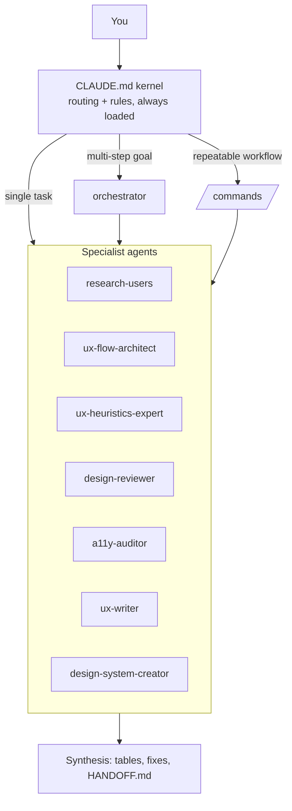

# UX Agents Starter

**A team of UX specialists inside Claude Code — install in 2 minutes, ship better design today.**

UX Agents Starter is a small, opinionated multi-agent system for designers who build with [Claude Code](https://docs.claude.com/en/docs/claude-code). It gives you an orchestrator plus seven UX specialists (research, flows, heuristics, visual review, accessibility, UX writing, design systems) and a handful of repeatable commands.

## Why

Designers increasingly ship real products with AI agents. A single generic assistant forgets your standards, skips accessibility and redesigns things you didn't ask for. This starter encodes how a senior UX team works:

- **Ask first**: agents stop and ask when scope or intent is unclear.
- **Design system first**: tokens before hardcoded values.
- **WCAG 2.2 AA always**: contrast and keyboard access checked on every change.
- **Evidence over opinion**: findings cite file:line, screen region or source.
- **Thin agents, small context**: each specialist loads only when needed.

## Architecture



## Install (3 steps)

```bash
# 1. Clone
git clone https://github.com/Vicentehersant/ux-agents-starter.git
# 2. Install into your project (never overwrites unless you pass --force)
./ux-agents-starter/install.sh /path/to/your-project
# 3. Open your project in Claude Code
cd /path/to/your-project && claude
```

If your project already has a `CLAUDE.md`, the kernel is saved as `CLAUDE.ux-agents.md`; add the line `@CLAUDE.ux-agents.md` to your `CLAUDE.md` to load it.

## Example prompts

- "Audit the checkout flow and give me the top 5 fixes." (orchestrator)
- `/ux-audit app/pricing/page.tsx`
- `/research-plan Why do trial users not invite teammates?`
- `/a11y-pass components/Modal.tsx`
- "Rewrite the error messages in the sign-up form." (ux-writer)
- "Create color and spacing tokens from our current CSS." (design-system-creator)
- `/handoff` at the end of a session

See [examples/example-session.md](examples/example-session.md) for a full walkthrough.

## Agents

| Agent | What it does |
|---|---|
| `orchestrator` | Plans multi-step goals, picks specialists, returns one verified synthesis |
| `research-users` | Research plans, interview guides, personas, journey maps, synthesis |
| `ux-flow-architect` | User flows and information architecture, as mermaid diagrams |
| `ux-heuristics-expert` | Nielsen heuristic evaluation with severity ratings |
| `design-reviewer` | Visual/UI critique: hierarchy, spacing, type, consistency, tokens |
| `a11y-auditor` | WCAG 2.2 AA audit with code-level fixes |
| `ux-writer` | Microcopy, CTAs, errors, empty states |
| `design-system-creator` | Tokens, semantic layers, component specs, contrast tables |

## Commands

| Command | What it does |
|---|---|
| `/ux-audit <target>` | Heuristics + visual + accessibility audit, merged and prioritized |
| `/research-plan <question>` | Research plan and discussion guide |
| `/a11y-pass <target>` | WCAG pass with safe fixes applied |
| `/handoff` | Compact `HANDOFF.md` so the next session resumes instantly |

## Add your own agent

1. Copy `templates/agent-template.md` to `.claude/agents/<name>.md`.
2. Write a precise `description` — it is how Claude decides when to use the agent.
3. Keep the agent thin: role, ask-first, method, output format. Limit `tools` to what it needs.
4. Add it to the routing line in `CLAUDE.md` and the orchestrator's team table.

## Credits

Built by Vicente Hernaiz · [vicentehernaiz.tech](https://vicentehernaiz.tech). Derived from a larger personal agent operating system used to design and ship real products.

## License

[MIT](LICENSE)
