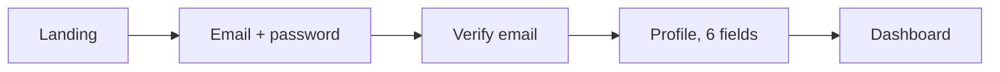

# Example session: auditing a sign-up flow

**You:** Audit our sign-up flow in `app/signup/` and tell me what to fix first.

**Claude (orchestrator):** Who is the primary user, and is the goal more completions or fewer support tickets?

**You:** Freelancers on mobile. More completions.

**Claude:** Plan: ux-flow-architect -> ux-heuristics-expert -> a11y-auditor -> ux-writer.

| # | Source | Location | Issue | Severity | Fix |
|---|---|---|---|---|---|
| 1 | Flow | step D | 6 required fields before any value | 3 | Defer profile to after first use |
| 2 | a11y | `signup/form.tsx:42` | Error not linked to input | 3 | `aria-describedby` on input |
| 3 | Heuristics | step C | No resend link while waiting | 2 | Add "Resend email" with timer |
| 4 | Copy | submit button | "Submit" | 1 | "Create my account" |

**Next:** fix 1-2, run `/a11y-pass app/signup`, then `/handoff`.
